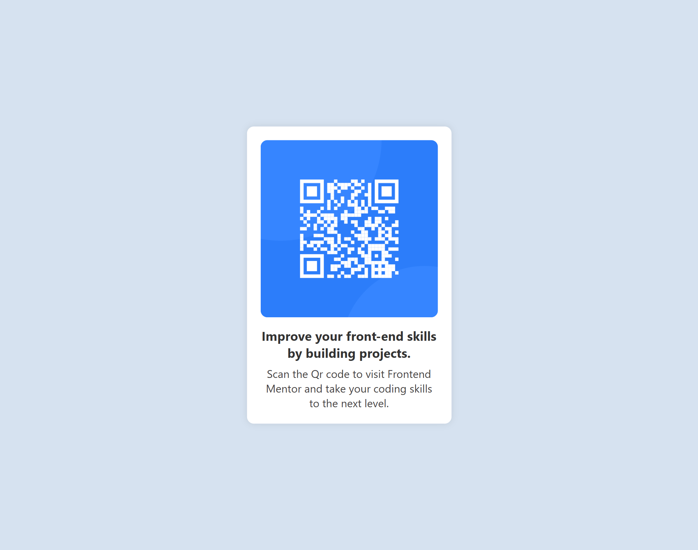

# Qr Code - FrontendMentor Challenge

## Overview
This a beginner level project from FrontendMentor. It was a basic and simple project to do.

## I used 

* HTML - For Structure
* CSS - For Styling

## Live Link
